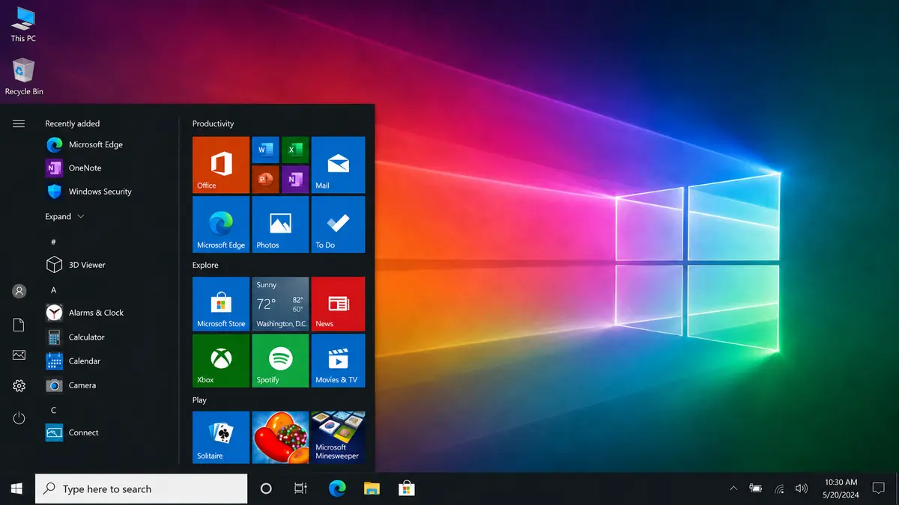
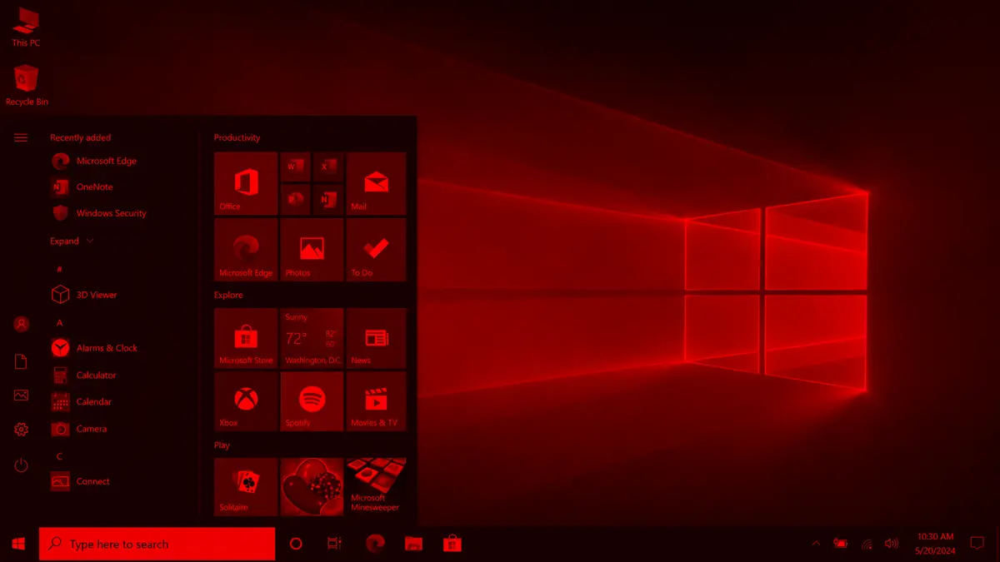
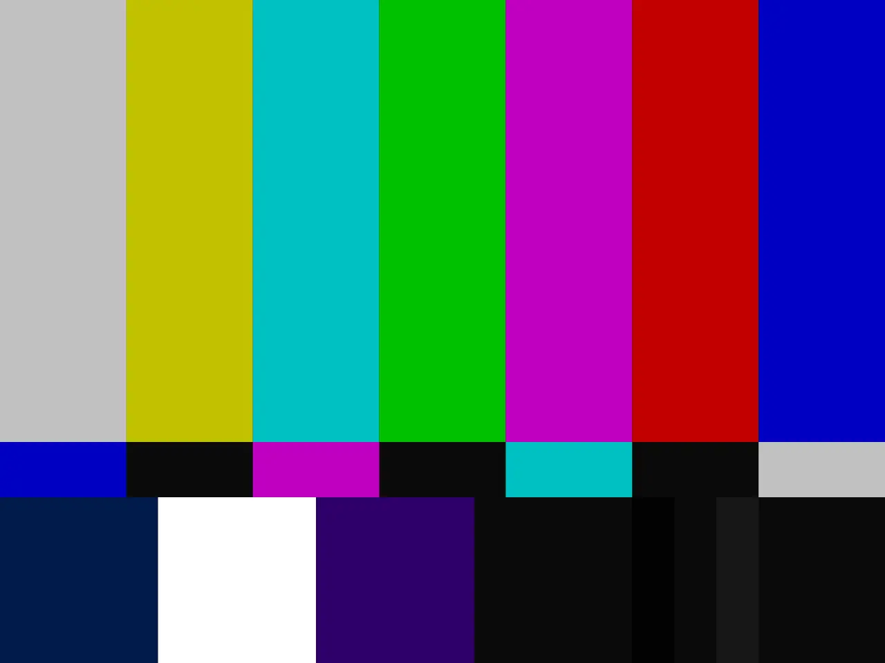
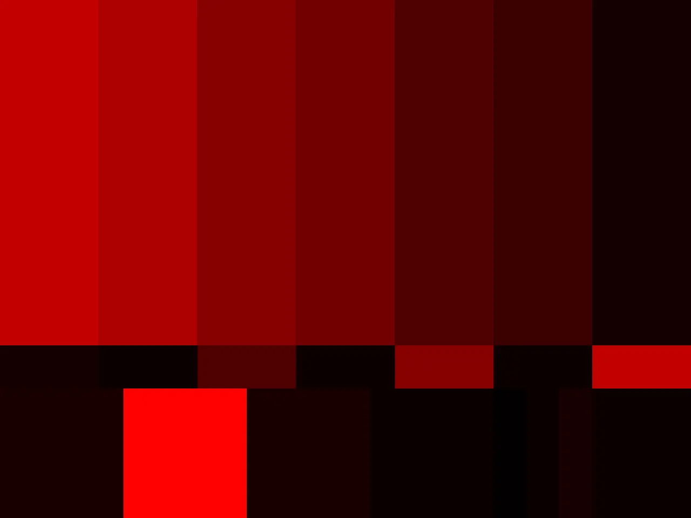

# RedLight
RedLight is a lightweight Windows tray application that applies a red-only display filter. It is not a translucent tint. The app runs from the system tray, allowing users to easily toggle the filter on and off with one click.

## Features
- **Toggle Red Filter**: Quickly enable or disable the red filter directly from the system tray.
- **Minimal Resource Usage**: Runs quietly in the background with essentially no impact on system performance.

## Red Modes
Strict Red is the original red-channel-only mode and transforms display output as follows:
- Black stays black.
- White becomes pure red.
- Red stays red.
- Green and blue output are eliminated.

Luma Red is the default mode when the Magnification API backend is active. It converts visible colors into red luma using BT.601-style luma weights:
- Output red = `0.299R + 0.587G + 0.114B`.
- Output green = `0`.
- Output blue = `0`.

Luma Red keeps the display red-only while making blue, green, and cyan UI elements visible as shades of red. It requires the Windows Magnification API backend because gamma ramps do not support cross-channel color mixing. If RedLight falls back to the gamma-ramp backend, RedLight starts in Strict Red and only Strict Red is available.

## Screenshots

### Desktop example

| Normal display | Luma Red mode |
| --- | --- |
|  |  |

### Color test example

| Normal color bars | Luma Red mode |
| --- | --- |
|  |  |

## Architecture
v0.5.1-beta uses the Windows Magnification API full-screen color transform as the preferred backend, with Luma Red as the default mode.
The legacy gamma-ramp backend is retained as a Strict Red fallback.

## Installation
To install RedLight, follow these steps:
1. Download the latest release from the [Releases](https://github.com/michaelmawhinney/redlight/releases) page.
2. Run `RedLight.exe` to start the application.

## Usage
After starting RedLight, an icon will appear in the system tray.

* Left-click on the icon to toggle between red mode and normal mode.
* Right-click the icon to access the following options:
  - **Toggle ON/off**: Enable or disable the red light filter.
  - **Strict Red**: Use the original red-channel-only mode.
  - **Luma Red**: Use the default luma-weighted red mode when the Magnification API backend is active.
  - **About**: Display information about the application.
  - **Exit**: Quit the application.

## Important Notes
* This application may conflict with other apps/features that change display color, such as f.lux, Windows Night Light, HDR/color calibration settings, GPU color controls, or similar display-color tools. If you want to use RedLight, you should close or disable similar apps/features to avoid unexpected behavior.
* RedLight is provided as-is and without any warranty of any kind. Although the code is simple and straightforward, you are still advised to use it at your own risk!

## Windows Security Notice

RedLight beta builds are currently unsigned. Because the executable is not code-signed, Windows or Microsoft Defender SmartScreen may show a warning before running it, especially the first time it is downloaded.

This warning does not necessarily mean RedLight is malicious; it means Windows does not yet recognize the publisher or file reputation. RedLight is open source, so users who are concerned are encouraged to inspect the source code, build the app themselves, or verify the downloaded executable against the SHA-256 checksum published with the release.

Do not run software you do not trust. RedLight is provided as-is and without warranty.

## Troubleshooting
* Log file: `%LOCALAPPDATA%\RedLight\redlight.log`
* Reset commands:
  * `RedLight.exe --restore`
  * `RedLight.exe --reset-display`
* Reset mode can ask a running tray instance to restore the display before falling back to direct recovery.

## Building from Source
RedLight is built and tested as a Windows x64 application. Use Visual Studio 2022 Build Tools or Visual Studio 2022 with the C++ toolchain installed.

### Prerequisites
- Windows OS
- CMake 3.20 or higher
- Visual Studio 2022 Build Tools or Visual Studio 2022
- x64 C++ toolchain

### Build Instructions
1. Clone the repository:
   ```
   git clone https://github.com/michaelmawhinney/redlight.git
   cd redlight
   ```
2. Run CMake to generate the build configuration:
   ```
   cmake -S . -B build -A x64
   ```
3. Build the project:
   ```
   cmake --build build --config Release
   ```
4. The release artifact is expected at `build\Release\RedLight.exe`

Local testing passed on a Windows 10 x64 system with two monitors.

## Contributing
Contributions are welcome! Feel free to open pull requests or issues to suggest improvements or add new features.

## License
RedLight is open source software [licensed as GPLv3](LICENSE).

## Acknowledgments
- Windows Magnification API full-screen color transform is used as the preferred display backend.
- Gamma ramp manipulation remains available as a fallback display backend on Windows.
- Icon and design resources were custom made for this project using Adobe Photoshop and ImageMagick.
